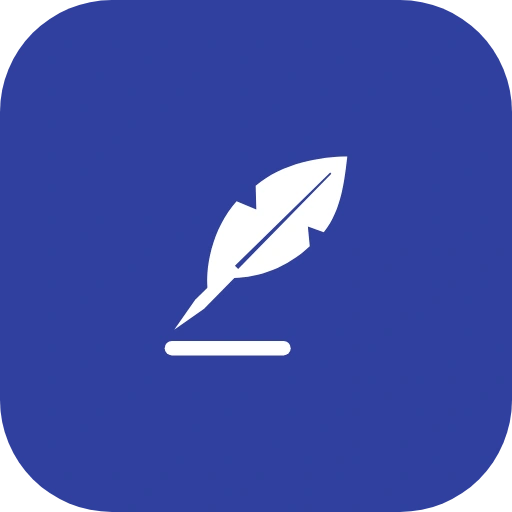

# Quill Keyboard



A private, offline keyboard with word suggestions and autocorrect, based on [Fossify Keyboard](https://github.com/FossifyOrg/Keyboard).

- **Word suggestions and autocorrect** in English, Spanish, Brazilian Portuguese, German and French. Autocorrect is optional, and pressing backspace right after a correction undoes it. New words you type are learned on your device.
- **Fully offline:** the app has no internet permission, so the dictionaries and the words it learns never leave your device. See the [privacy policy](PRIVACY.md).
- **Many languages and layouts**, a clipboard with pinned clips, and customizable colors, keyboard height, vibration and sounds.

<div align="center">


</div>

## Building

```sh
git clone --recurse-submodules https://github.com/blckassassin/Keyboard.git
cd Keyboard
./gradlew assembleFossRelease
```

The `commons` submodule is [a fork of Fossify Commons](https://github.com/blckassassin/Commons/tree/quill) without the checks against forks of the Fossify apps. It's built from source along with the app.

The dictionaries are built by `tools/dictionary/build_wordlist.py`, see [its README](tools/dictionary/README.md). Their licenses are in `app/src/main/assets/dictionaries/`.

## License

Quill Keyboard is licensed under the [GNU General Public License v3.0](LICENSE). It's based on Fossify Keyboard by Fossify and its contributors.
